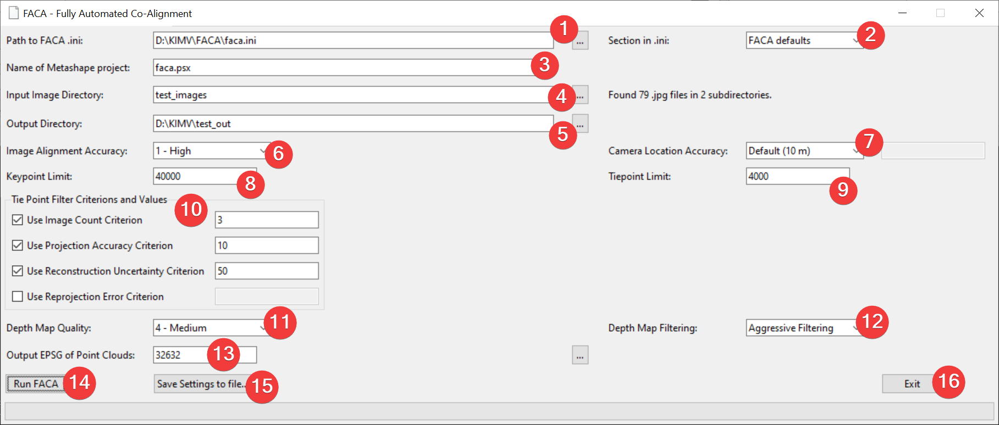

# FACA

[](TODO)

FACA (Fully Automated Co-Alignment) automates the co-alignment workflow.
Co-alignment uses common tiepoints over multiple surveys to increase the comparative precision ([Cook and Dietze, 2019](https://doi.org/10.5194/esurf-7-1009-2019)).
Initially developed for use with UAV imagery to research mass movements and coastal dynamics, FACA is suitable for any research needing precise, multi-temporal point cloud generation.
We tested FACA on Windows 10 with Metashape Professional Version 2.1.

## How to run FACA

FACA requires a licensed [Agisoft Metashape Professional Edition](https://www.agisoft.com/downloads/installer/) installation, the Agisoft Metashape Professional [Python 3 Module](https://www.agisoft.com/downloads/installer/) and [Python 3](https://www.python.org/downloads/).

### Running FACA on Windows

1. Make sure you have Python 3 installed (Python 3.10 tested), if not get it from [python.org/downloads](https://www.python.org/downloads/).
2. Download FACA.
3. Download the [Agisoft Metashape Professional Python 3 Module](https://www.agisoft.com/downloads/installer/) (navigate to Python 3 Module).
4. Navigate to the FACA directory and open a PowerShell window (if you downloaded a zipped version, unzip it first).
5. Create a virtual environment
```
py -m venv venv
```
6. Activate the virtual environment (venv should appear in the command line, indicating you were successful)
```
.\venv\Scripts\activate
```
7. Install the Agisoft Metashape Module (wheel file)
```
py -m pip install *path to .whl file*
```

You have sucessfully setup FACA.

To use it from now on just open a powershell in the FACA directory and activate the virtual environment.
For Instructions and Examples see [Usage](#Usage).

## Usage

There are multiple ways to interact with FACA, either trough a [Graphical User Interface (GUI)](#faca-gui), [interactively](#faca-interactive-mode), or [scripted](#faca-script-mode) on the command line.
FACA makes few assumptions about the [images and their structure](#required-data-and-structure).

For a full list of available options, and some examples, see:
```
py .\faca_main.py --help
```

Before starting we advise changing the default [EPSG code](https://epsg.io/) to suit your projects area in the provided default configuration file 'faca.ini'. 

### Required Data and Structure

The input directory must contain at least two subdirectories, each with survey images in JPG format.
These subdirectories can include any number of additional subdirectories.

### FACA GUI

Launch FACA in GUI mode:
```
py .\faca_main.py --ui
```



Either select a configuration file (1) and parameter section (2), define the calculation parameters (3 - 13) yourself, or use a combination of these options.
You can then start the calculation (14), or save your settings to a configuration file (15), appending a new section if the file already exists, using a guided dialog.
You can exit the program at any time (16).

### FACA interactive mode

Launch FACA in interactive mode:
```
py .\faca_main.py
```
You will be guided through the parameterization process on the command line.

Alternatively, you can define any amount of parameters beforehand, and their associated prompts will be skipped.
For example:
```
py .\faca_main.py --input_image_dir C:\new_input_dir
```
This command will guide you through the parameterization process but skip the question about the input image directory and use the defined value.

### FACA script mode

Launch FACA in script mode:
```
py .\faca_main.py --iniFile faca.ini --Section "FACA Defaults"
```
This command will start the calculation with the parameters stored in the specified section of the given configuration file.

Alternativly, you can override some of the parameters from the configuration file section with ones defined on the command line.
For example:
```
py .\faca_main.py --iniFile faca.ini --Section "FACA Defaults" --input_image_dir C:\new_input_dir
```
This command will start the calculation using the parameters from the configuration file section but will replace the input image directory with the specified value.

As another option, you can define every parameter directly on the command line.
For example:
```
py .\faca_main.py --input_image_dir images --output_dir out --output_epsg_code 32632 --project_name faca.psx --alignment_accuracy 1 --camera_accuracy None --keypoint_limit 40000 --tiepoint_limit 4000 --criterions ImageCount,ReconstructionUncertainty,ProjectionAccuracy --criterion_values 3,50,10 --depth_map_quality 4 --depth_map_filtering AggressiveFiltering
```
This command will replicate the FACA default values.

## Test dataset

We offer a test dataset [here](TODO).

## License

Distributed under the GPLv3 License, see LICENSE.txt.

## Feedback and Contributions

Bug reports, feature requests and contributions are welcome.
Please use the features provided by GitHub to submit them.